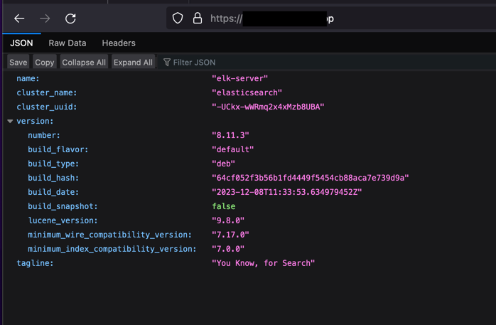

## Elasticsearch version: 8.x

### Prerequisites
- An Ubuntu 22.04 server with 4GB RAM and 2 CPUs set up with a non-root sudo user. You can achieve this by following the [Initial Server Setup with Ubuntu 22.04](https://www.digitalocean.com/community/tutorials/initial-server-setup-with-ubuntu-22-04).For this tutorial, we will work with the amount of 4vCPUs and 8GB of RAM to run Elasticsearch. Note that the amount of CPU, RAM, and storage that your Elasticsearch server will require depends on the volume of logs that you expect.
- Nginx installed on your server, which we will configure later in this guide as a reverse proxy for Kibana. Follow our guide in this post.

### Let's begin

```
$ wget -O - https://artifacts.elastic.co/GPG-KEY-elasticsearch | gpg --dearmor -o /etc/apt/keyrings/elasticsearch-keyring.gpg
```

```
$ echo "deb [signed-by=/etc/apt/keyrings/elasticsearch-keyring.gpg] https://artifacts.elastic.co/packages/8.x/apt stable main" | tee /etc/apt/sources.list.d/elastic-8.x.list
```

### Update system
```
$ sudo apt update
```

### Install Elasticsearch
```
$ sudo apt -y install elasticsearch
```

```
.....
.....
--------------------------- Security autoconfiguration information ------------------------------

Authentication and authorization are enabled.
TLS for the transport and HTTP layers is enabled and configured.

The generated password for the elastic built-in superuser is : `<password>`

If this node should join an existing cluster, you can reconfigure this with
'/usr/share/elasticsearch/bin/elasticsearch-reconfigure-node --enrollment-token <token-here>'
after creating an enrollment token on your existing cluster.

You can complete the following actions at any time:

Reset the password of the elastic built-in superuser with
'/usr/share/elasticsearch/bin/elasticsearch-reset-password -u elastic'.

Generate an enrollment token for Kibana instances with
 '/usr/share/elasticsearch/bin/elasticsearch-create-enrollment-token -s kibana'.

Generate an enrollment token for Elasticsearch nodes with
'/usr/share/elasticsearch/bin/elasticsearch-create-enrollment-token -s node'.

```

### Enable Elasticsearch
```
$ sudo systemctl enable --now elasticsearch
```

### Backup Elasticsearch origin:
```
$ cp /etc/elasticsearch/elasticsearch.yml /etc/elasticsearch/elasticsearch.yml.orig
```

### Test Elasticsearch
```
$ curl -u elastic --cacert /etc/elasticsearch/certs/http_ca.crt https://127.0.0.1:9200
```
And enter password
```
Enter host password for user 'elastic':
```

Result:
```
{
  "name" : "elk-server",
  "cluster_name" : "elasticsearch",
  "cluster_uuid" : "OUtoEHtlRWmPmeNKz0MhHQ",
  "version" : {
    "number" : "8.11.3",
    "build_flavor" : "default",
    "build_type" : "deb",
    "build_hash" : "64cf052f3b56b1fd4449f5454cb88aca7e739d9a",
    "build_date" : "2023-12-08T11:33:53.634979452Z",
    "build_snapshot" : false,
    "lucene_version" : "9.8.0",
    "minimum_wire_compatibility_version" : "7.17.0",
    "minimum_index_compatibility_version" : "7.0.0"
  },
  "tagline" : "You Know, for Search"
}
```
```
$ curl -u elastic --cacert /etc/elasticsearch/certs/http_ca.crt https://127.0.0.1:9200/_aliases?pretty
```
And enter password
```
Enter host password for user 'elastic':
```

Result:
```
{
  ".security-7" : {
    "aliases" : {
      ".security" : {
        "is_hidden" : true
      }
    }
  }
}
```

## Install NGINX
```
$ sudo apt install nginx -y
```

```
$ nginx -v
```
Result:
```
nginx version: nginx/1.18.0 (Ubuntu)
```

```
$ cd /etc/nginx && ls -la
```
Result:
```
total 72
drwxr-xr-x  8 root root 4096 Jan  7 16:33 .
drwxr-xr-x 95 root root 4096 Jan  7 16:33 ..
drwxr-xr-x  2 root root 4096 May 30  2023 conf.d
-rw-r--r--  1 root root 1125 May 30  2023 fastcgi.conf
-rw-r--r--  1 root root 1055 May 30  2023 fastcgi_params
-rw-r--r--  1 root root 2837 May 30  2023 koi-utf
-rw-r--r--  1 root root 2223 May 30  2023 koi-win
-rw-r--r--  1 root root 3957 May 30  2023 mime.types
drwxr-xr-x  2 root root 4096 May 30  2023 modules-available
drwxr-xr-x  2 root root 4096 Jan  7 16:33 modules-enabled
-rw-r--r--  1 root root 1447 May 30  2023 nginx.conf
-rw-r--r--  1 root root  180 May 30  2023 proxy_params
-rw-r--r--  1 root root  636 May 30  2023 scgi_params
drwxr-xr-x  2 root root 4096 Jan  7 16:33 sites-available
drwxr-xr-x  2 root root 4096 Jan  7 16:33 sites-enabled
drwxr-xr-x  2 root root 4096 Jan  7 16:33 snippets
-rw-r--r--  1 root root  664 May 30  2023 uwsgi_params
-rw-r--r--  1 root root 3071 May 30  2023 win-utf
```

Let's check Nginx with `systemctl`
```
$ sudo systemctl status nginx
```

Result:
```
● nginx.service - A high performance web server and a reverse proxy server
     Loaded: loaded (/lib/systemd/system/nginx.service; enabled; vendor preset: enabled)
     Active: active (running) since Sun 2024-01-07 16:33:42 UTC; 27min ago
       Docs: man:nginx(8)
    Process: 9709 ExecStartPre=/usr/sbin/nginx -t -q -g daemon on; master_process on; (code=exited, status=0/SUCCESS)
    Process: 9710 ExecStart=/usr/sbin/nginx -g daemon on; master_process on; (code=exited, status=0/SUCCESS)
   Main PID: 9809 (nginx)
      Tasks: 5 (limit: 9492)
     Memory: 5.4M
        CPU: 48ms
```
Now you can configure Nginx reverse proxy for your Elasticsearch on Ubuntu 22.04. To do this, follow the steps below.

First, remove the default Nginx configurations by running the commands below:
```
$ sudo rm /etc/nginx/sites-available/default
$ sudo rm /etc/nginx/sites-enabled/default
```

Then, create a new Nginx configuration file with your favorite text editor, here we use `vim`:
```text
$ sudo vim /etc/nginx/sites-available/your_domain.conf
```
Add the following content to the file:
```
server {
     listen [::]:80;
     listen 80;

     server_name your_domain;

     location / {
         proxy_pass https://localhost:9200;
         proxy_redirect off;
         proxy_read_timeout 90;
         proxy_connect_timeout 90;
         proxy_set_header X-Real-IP  $remote_addr;
         proxy_set_header X-Forwarded-For $proxy_add_x_forwarded_for;
         proxy_set_header Host $http_host;
    }
}
```
When you are done, save and close the file.

Check NGINX syntax:
```
$ sudo nginx -t
```

Next, enable your Nginx configuration on Ubuntu 22.04:
```
$ sudo ln -s /etc/nginx/sites-available/elastic.gotcloud.app.conf /etc/nginx/sites-enabled/elastic.gotcloud.app.conf
```

Reload NGINX syntax:
```
$ sudo systemctl reload nginx
```

Allow Nginx Full in Firewall
> NOTE: Please make sure that you've enabled port 22 to SSH.

```
$ sudo ufw enable
```
```
$ ufw allow 'Nginx Full'
```

Check status again
```
$ sudo ufw status
```

```
Status: active

To                         Action      From
--                         ------      ----
Nginx Full                 ALLOW       Anywhere
22                         ALLOW       Anywhere
Nginx Full (v6)            ALLOW       Anywhere (v6)
22 (v6)                    ALLOW       Anywhere (v6)
```

## Set up Certbot Nginx on Ubuntu 22.04

At this point, you need to install Certbot by Let’s Encrypt for Ubuntu 22.04 by using the command below:
```
$ sudo apt install python3-certbot-nginx
```

Then, receive your SSL certificates by using the command below:
```
$ sudo certbot --nginx
```

### Steps by Steps:
```
Saving debug log to /var/log/letsencrypt/letsencrypt.log
Enter email address (used for urgent renewal and security notices)
 (Enter 'c' to cancel): <your_email>

- - - - - - - - - - - - - - - - - - - - - - - - - - - - - - - - - - - - - - - -
Please read the Terms of Service at
https://letsencrypt.org/documents/LE-SA-v1.3-September-21-2022.pdf. You must
agree in order to register with the ACME server. Do you agree?
- - - - - - - - - - - - - - - - - - - - - - - - - - - - - - - - - - - - - - - -
(Y)es/(N)o: Y

- - - - - - - - - - - - - - - - - - - - - - - - - - - - - - - - - - - - - - - -
Would you be willing, once your first certificate is successfully issued, to
share your email address with the Electronic Frontier Foundation, a founding
partner of the Let's Encrypt project and the non-profit organization that
develops Certbot? We'd like to send you email about our work encrypting the web,
EFF news, campaigns, and ways to support digital freedom.
- - - - - - - - - - - - - - - - - - - - - - - - - - - - - - - - - - - - - - - -
(Y)es/(N)o: Y
Account registered.

Which names would you like to activate HTTPS for?
- - - - - - - - - - - - - - - - - - - - - - - - - - - - - - - - - - - - - - - -
1: elastic.gotcloud.app
- - - - - - - - - - - - - - - - - - - - - - - - - - - - - - - - - - - - - - - -
Select the appropriate numbers separated by commas and/or spaces, or leave input
blank to select all options shown (Enter 'c' to cancel): 1
Requesting a certificate for <your_domain>

Successfully received certificate.
Certificate is saved at: /etc/letsencrypt/live/<your_domain>/fullchain.pem
Key is saved at:         /etc/letsencrypt/live/<your_domain>/privkey.pem
This certificate expires on 2024-04-06.
These files will be updated when the certificate renews.
Certbot has set up a scheduled task to automatically renew this certificate in the background.

Deploying certificate
Successfully deployed certificate for elastic.gotcloud.app to /etc/nginx/sites-enabled/elastic.gotcloud.app.conf
Congratulations! You have successfully enabled HTTPS on https://elastic.gotcloud.app
We were unable to subscribe you the EFF mailing list because your e-mail address appears to be invalid. You can try again later by visiting https://act.eff.org.

- - - - - - - - - - - - - - - - - - - - - - - - - - - - - - - - - - - - - - - -
If you like Certbot, please consider supporting our work by:
 * Donating to ISRG / Let's Encrypt:   https://letsencrypt.org/donate
 * Donating to EFF:                    https://eff.org/donate-le
- - - - - - - - - - - - - - - - - - - - - - - - - - - - - - - - - - - - - - - -
```

### Renew:
```
$ sudo certbot renew --dry-run
```

```
Saving debug log to /var/log/letsencrypt/letsencrypt.log

- - - - - - - - - - - - - - - - - - - - - - - - - - - - - - - - - - - - - - - -
Processing /etc/letsencrypt/renewal/<your_domain>.conf
- - - - - - - - - - - - - - - - - - - - - - - - - - - - - - - - - - - - - - - -
Account registered.
Simulating renewal of an existing certificate for elastic.gotcloud.app

- - - - - - - - - - - - - - - - - - - - - - - - - - - - - - - - - - - - - - - -
Congratulations, all simulated renewals succeeded:
  /etc/letsencrypt/live/<your_domain>/fullchain.pem (success)
- - - - - - - - - - - - - - - - - - - - - - - - - - - - - - - - - - - - - - - -
```

## Result
After all above steps, we are now can access to our Elasticsearch homepage

