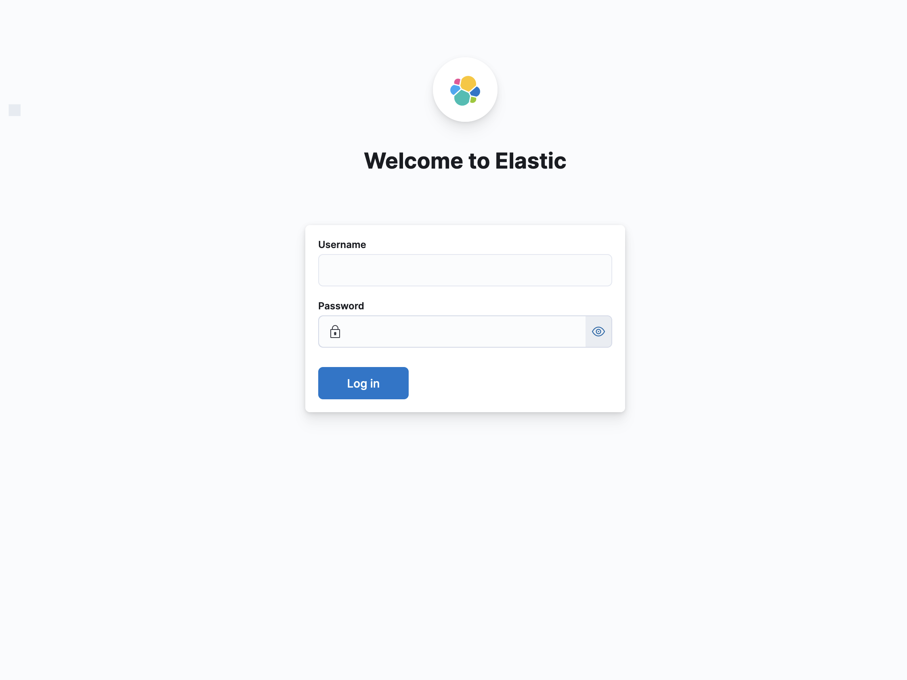
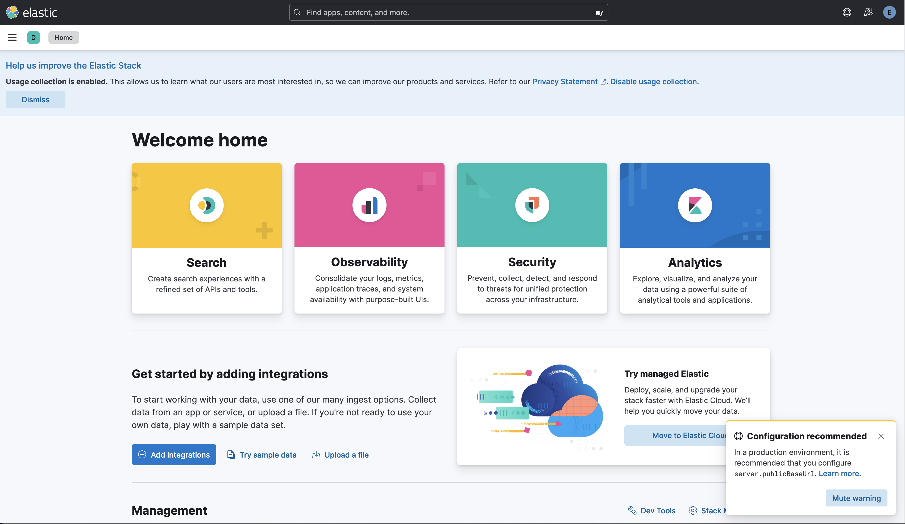

## Kibana version: 8.x

### Prerequisites
- An Ubuntu 22.04 server with 4GB RAM and 2 CPUs set up with a non-root sudo user. You can achieve this by following the [Initial Server Setup with Ubuntu 22.04](https://www.digitalocean.com/community/tutorials/initial-server-setup-with-ubuntu-22-04).For this tutorial, we will work with the amount of 4vCPUs and 8GB of RAM to run Elasticsearch. Note that the amount of CPU, RAM, and storage that your Kibana server will require depends on the volume of logs that you expect.
- Nginx installed on your server, which we will configure later in this guide as a reverse proxy for Kibana. Follow our guide in this post.

### Let's begin

```
$ apt -y install kibana
```

## generate an enrollment token for Kibana

/usr/share/elasticsearch/bin/elasticsearch-create-enrollment-token -s kibana

eyJ2ZXIiOiI4LjExLjMiLCJhZHIidfdAA9swOS4xMTAuMTMxOjkyMDAiXSwiZmdyIjoiZWQzNzQwYzc2MWYxMzc3MWQ5ZDRlZmFhNjdmNTQxZDQ2NWIwNThlODFhZjM5ZGY0NDEyNjlmMTQwMWYxNDBjMyIsImtleSI6ImZhWEw1NHdCM0xtVFo4aml1Nzh1OllXSndOQUxJVGtDVTNDNXhXN0E4eHcifQ==

## setup Kibana

```
$ /usr/share/kibana/bin/kibana-setup --enrollment-token <token_above>
```

Result:
```
✔ Kibana configured successfully.

To start Kibana run:
  bin/kibana
```

## Configuration

### Backup
```
$ cp /etc/kibana/kibana.yml /etc/kibana/kibana.yml.orig
```

```
$ vi /etc/kibana/kibana.yml
```

```
# line 11 : if access to Kibana from other hosts, uncomment and change to "0.0.0.0" (listen all), otherwise change to "localhost"

server.host: "localhost"
```

if you have more configs, feel free to do it.

### Start Kibana
```
$ systemctl enable --now kibana
```

## Setup NGINX for Kibana domain
Then, create a new Nginx configuration file with your favorite text editor, here we use `vim`:
```text
$ sudo vim /etc/nginx/sites-available/<your_domain>.conf
```
Add the following content to the file:
```
server {
     listen [::]:80;
     listen 80;

     server_name <your_domain>;

     location / {
         proxy_pass http://localhost:5601;
         proxy_redirect off;
         proxy_read_timeout 90;
         proxy_connect_timeout 90;
         proxy_set_header X-Real-IP  $remote_addr;
         proxy_set_header X-Forwarded-For $proxy_add_x_forwarded_for;
         proxy_set_header Host $http_host;
    }
}
```
When you are done, save and close the file.

Check NGINX syntax:
```
$ sudo nginx -t
```

Next, enable your Nginx configuration on Ubuntu 22.04:
```
$ sudo ln -s /etc/nginx/sites-available/<your_domain>.conf /etc/nginx/sites-enabled/<your_domain>.conf
```

Reload NGINX syntax:
```
$ sudo systemctl reload nginx
```

## Set up Certbot Nginx on Ubuntu 22.04
Then, receive your SSL certificates by using the command below:
```
$ sudo certbot --nginx
```

### Steps by Steps:
```
Saving debug log to /var/log/letsencrypt/letsencrypt.log

Which names would you like to activate HTTPS for?
- - - - - - - - - - - - - - - - - - - - - - - - - - - - - - - - - - - - - - - -
1: <your_domain>
- - - - - - - - - - - - - - - - - - - - - - - - - - - - - - - - - - - - - - - -
Select the appropriate numbers separated by commas and/or spaces, or leave input
blank to select all options shown (Enter 'c' to cancel): 1
Requesting a certificate for kibana.gotcloud.app

Successfully received certificate.
Certificate is saved at: /etc/letsencrypt/live/<your_domain>/fullchain.pem
Key is saved at:         /etc/letsencrypt/live/<your_domain>/privkey.pem
This certificate expires on 2024-04-07.
These files will be updated when the certificate renews.
Certbot has set up a scheduled task to automatically renew this certificate in the background.

Deploying certificate
Successfully deployed certificate for kibana.gotcloud.app to /etc/nginx/sites-enabled/<your_domain>.conf
Congratulations! You have successfully enabled HTTPS on <your_domain>

- - - - - - - - - - - - - - - - - - - - - - - - - - - - - - - - - - - - - - - -
If you like Certbot, please consider supporting our work by:
 * Donating to ISRG / Let's Encrypt:   https://letsencrypt.org/donate
 * Donating to EFF:                    https://eff.org/donate-le
- - - - - - - - - - - - - - - - - - - - - - - - - - - - - - - - - - - - - - - -
```

### Renew:
```
$ sudo certbot renew --dry-run
```

```
Saving debug log to /var/log/letsencrypt/letsencrypt.log

- - - - - - - - - - - - - - - - - - - - - - - - - - - - - - - - - - - - - - - -
Processing /etc/letsencrypt/renewal/<your_domain>.conf
- - - - - - - - - - - - - - - - - - - - - - - - - - - - - - - - - - - - - - - -
Account registered.
Simulating renewal of an existing certificate for <your_domain>

- - - - - - - - - - - - - - - - - - - - - - - - - - - - - - - - - - - - - - - -
Congratulations, all simulated renewals succeeded:
  /etc/letsencrypt/live/<your_domain>/fullchain.pem (success)
- - - - - - - - - - - - - - - - - - - - - - - - - - - - - - - - - - - - - - - -
```
## Result
After all above steps, we are now can access to our Kibana pages



Phewwwww! After saw this login page, we just need to login into our Kibana with the credential of Elasticsearch

And boooom, our Kibana Home page


